# IHW2-OS
# Прозорский Михаил Алексеевич
# БПИ224
## Вариант 21
### Условие
Задача о нелюдимых садовниках. Имеется пустой участок земли (двумерный массив размером M × N ) и план сада, разбитого на отдельные квадраты. От 10 до 30 процентов (задается случайно) площади сада заняты прудами или камнями. То есть недоступны для ухаживания. Эти квадраты располагаются на плане произвольным (случайным) образом. Ухаживание за садом выполняют два садовника, которые не хотят встречаться друг другом (то есть, одновременно появляться в одном и том же квадрате). Первый садовник начинает работу с верхнего левого угла сада и перемещается слева направо, сделав ряд, он спускается вниз и идет в обратном направлении, пропуская обработанные участки. Второй садовник начинает работу с нижнего правого угла сада и перемещается снизу вверх, сделав ряд, он перемещается влево и также идет в обратную сторону. Если садовник видит, что участок сада уже обработан другим садовником или является необрабатываемым, он идет дальше. Если по пути какой-то участок занят другим садовником, то садовник ожидает когда участок освободится, чтобы пройти дальше на доступный ему необработанный участок. Садовники должны работать одновременно со скоростями, определяемыми как параметры задачи. Прохождение через любой квадрат занимает некоторое время, которое задается константой, меньшей чем времена обработки и принимается за единицу времени.
Создать многопроцессное приложение, моделирующее работу садовников.
Каждый садовник — это отдельный процесс

### Решение
Участок земли представляет собой квадрат N*N. Если какой-то кусок участка занят препятствием, то на выводе этот участок отображается X. Каждому квадрату на участке соответствует Semaphore. Когда садовник пытается зайти на этот квадрат, он блокирует этот Semaphore, а после обработки квадратика садовник записывает в него свой номер.
Если садовнику встречаются препятствия то время прохождения равно working_time / 2.

Задание выполнялось на восемь баллов.

### Требования
#### 4-5
1. В отчете необходимо привести фамилию, имя, отчество исполнителя, группу.
2. Привести номер варианта и условие задачи.
3. Представить сценарий решаемой задачи поясняющий, каким образом исходные сущности и их поведение отображаются в процессы
и их взаимодействие.
4. В зависимости от выбранной схемы решения программа может использовать обмен данными через общую или разделяемую память.
Применение семафоров в программе возможно по одному
из следующих вариантов (на выбор разработчика):
• Множество процессов взаимодействуют с использованием именованных POSIX семафоров. Обмен данными ведется через
разделяемую память в стандарте POSIX. (выбран этот вариант)
• Множество процессов взаимодействуют с использованием неименованных POSIX семафоров расположенных в разделяемой памяти. Обмен данными также ведется через разделяемую память в стандарте POSIX.
5. Реализовать завершение программы в соответствии с условием задачи, а также предусмотреть корректное завершение по прерыванию с клавиатуры по соответствующему сигналу.
6. В программе предусмотреть удаление семафоров и разделяемой
памяти по ее завершению любым из способов.
7. Результаты работы программы должны быть отражены в отчете.
#### 6-7
В дополнение к программе на предыдущую оценку необходимо разработать программу, в которой для взаимодействия
процессов используется один из двух вариантов, описанных
выше, но не реализованных на предшествующую оценку.
1. Отчет расширить информацией о добавленной реализации и привести
соответствующие результаты работы программы.
2. Выбран вариант: Множество процессов взаимодействуют с использованием неименованных POSIX семафоров расположенных в разделяемой памяти. Обмен данными также ведется через разделяемую память в стандарте POSIX. (плохо работает с системой MacOs, так как она не поддерживает неименованные семафоры).
#### 8
В дополнение к программам на предыдущие оценки необходимо разработать приложение, состоящую из отдельных программ–
процессов, запускаемых независимо друг от друга. Требования:
1. Для завершения приложения использовать те же подходы, что и в
предыдущих решениях.
2. Приложение может использовать обмен данными через разделяемую память. Применение семафоров в программе возможно по
следующему варианту:
• Множество независимых процессов взаимодействуют с использованием семафоров в стандарте UNIX SYSTEM V. Обмен данными ведется через разделяемую память в стандарте UNIX
SYSTEM V.
3. В отчет расширить информацией о добавленной реализации и привести соответствующие результаты работы программы.

### Замечание
Для запуска программ требуется ввести команду

```console
make
./program size first_speed second_speed
```
где size - это длина стороны, деленная на 2. first_speed и second_speed - скорости садовников

### Реализация и тесты
#### 4-5
• Некорректный ввод

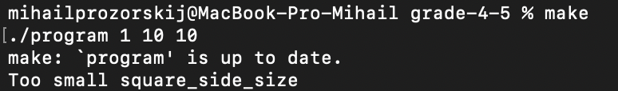
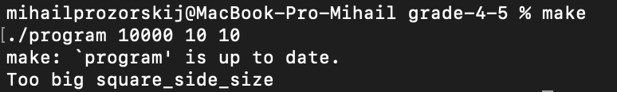
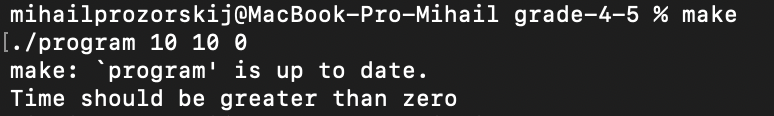
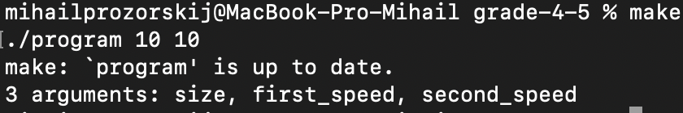

• Корректный ввод

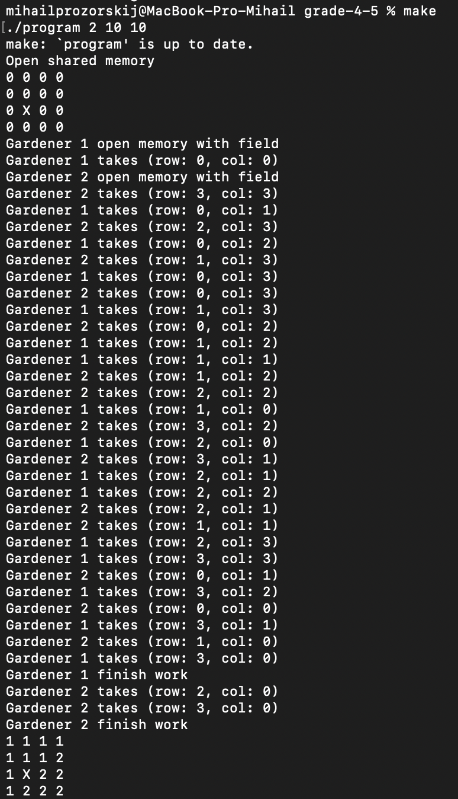
#### 6-7
• Некорректный ввод

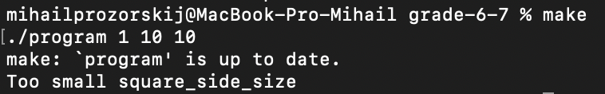
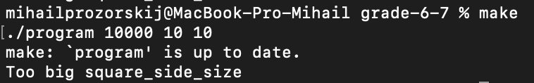
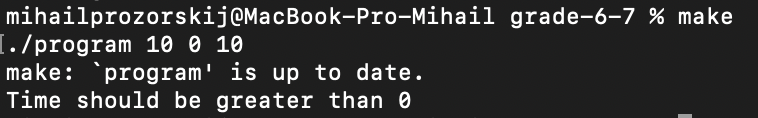
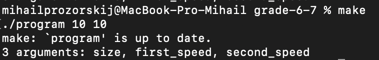

• Корректный ввод

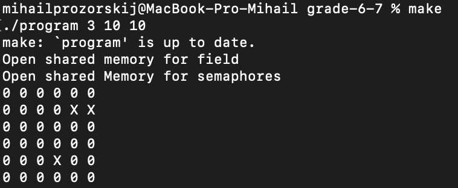
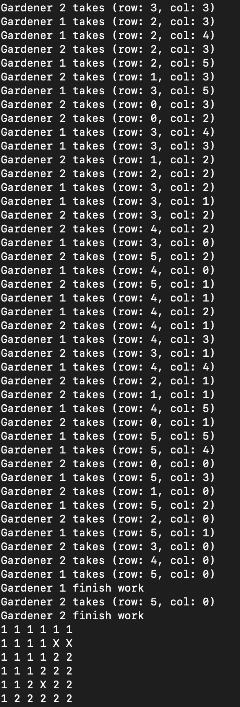
#### 8
• Некорректный ввод

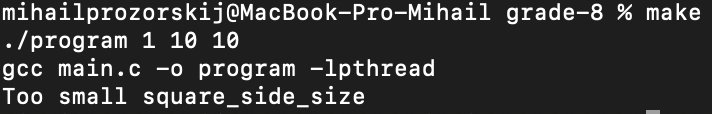
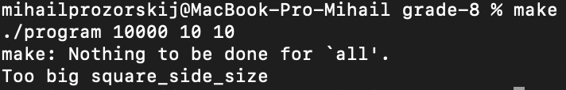
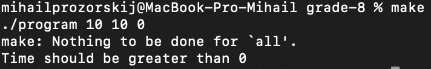
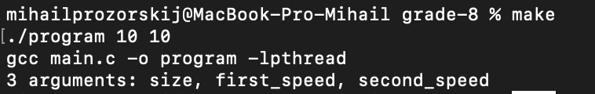

• Корректный ввод

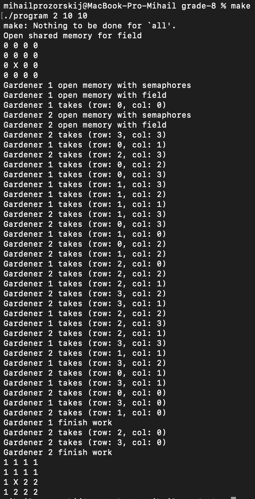
